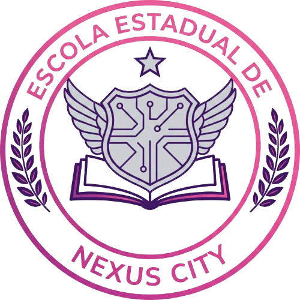
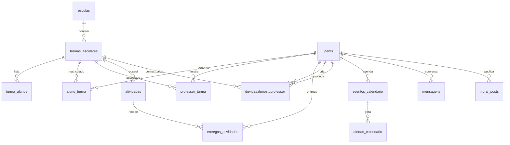

<div align="center">



# NexusClass

Plataforma educacional interativa projetada para modernizar a comunicação e gestão escolar entre alunos, professores e administradores. Construída com React 19, TypeScript, Tailwind CSS v4 e Supabase.

[](https://nodejs.org)
[](https://react.dev)
[](https://www.typescriptlang.org)
[](https://vite.dev)
[](https://tailwindcss.com)
[](https://supabase.com)
[](https://ai.google.dev)

[Visão Geral](#-visão-geral) • [Modelagem do Sistema](#-modelagem-do-sistema) • [Recursos Principais](#-recursos-principais) • [Arquitetura de Banco de Dados](#-arquitetura-de-banco-de-dados) • [Tecnologias](#-tecnologias-utilizadas) • [Pré-requisitos](#-pré-requisitos) • [Instalação](#-instalação) • [Configuração](#-configuração) • [Estrutura](#-estrutura-do-projeto)

</div>

---

## 🌐 Visão Geral

O **NexusClass** é uma solução escolar integrada de ponta a ponta. Ele conecta alunos e professores em um ecossistema digital composto por mural de avisos, chat em tempo real, assistente virtual inteligente alimentado por IA (tutor *Tigreso* via Gemini), portal de atividades com verificação automatizada de prazos e um canal estruturado para resolução de dúvidas com anexos. A segurança do sistema é regida por políticas RLS robustas e um processo automatizado de exclusão de dados em conformidade com as regulamentações de privacidade.

---

## 🗺️ Modelagem do Sistema

O planejamento e a modelagem conceitual da aplicação antecederam sua implementação e estão documentados em detalhes na pasta do projeto e na especificação oficial de requisitos:

> [!NOTE]
> Acesse o [Documento de Planejamento e Modelagem do NexusClass](https://docs.google.com/document/d/1By-bhNEzCsuZFOqb4rJt2Wj1VXxE5OucCwXfb5eE5Fk/edit?usp=sharing) para visualizar o levantamento completo de requisitos funcionais e não-funcionais, especificações técnicas e diagramas conceituais da aplicação.

### Diagrama de Entidade-Relacionamento (ERD)

O esquema relacional implementado no banco de dados Supabase reflete a seguinte estrutura de dados:



---

## ✨ Recursos Principais

- **Painel de Turmas & Mural**: Gestão escolar segmentada. O Mural unifica as novidades, avisos e posts da turma com suporte a arquivos anexos.
- **Tigreso (Assistente IA)**: Chatbot integrado com o SDK oficial do Google Gemini AI, atuando como um tutor virtual configurado para tirar dúvidas acadêmicas e sugerir roteiros de estudo.
- **Central de Atividades & Notas**:
  - Alunos podem enviar tarefas anexando arquivos a um bucket privado do Supabase Storage.
  - Validação inteligente de prazos via trigger no banco (`trigger_verificar_prazo`) comparando a data de envio à data limite da atividade.
  - Professores e administradores contam com portal de avaliação para fornecer notas (0.00 a 10.00) e feedbacks em tempo real.
- **Canal de Dúvidas (Fórum Aluno-Professor)**:
  - Canal direto com suporte a múltiplos anexos.
  - Gatilho inteligente no banco (`trigger_deletar_anexos_duvida`) para remover anexos do storage automaticamente ao deletar uma dúvida.
  - Rotina automatizada de limpeza que deleta dúvidas marcadas como resolvidas no primeiro dia de cada mês.
- **Calendário Letivo & Alertas em Tempo Real**:
  - Agendamento de provas e reuniões com diferenciação visual entre eventos escolares e pessoais.
  - Sistema de cron job no banco de dados (`pg_cron`) disparado a cada minuto para calcular e enviar notificações 1 e 5 minutos antes do início de cada evento.
- **Privacidade & Zona de Perigo (LGPD/GDPR)**:
  - Protocolo transacional seguro de autoexclusão de conta via Edge Function (`deletar-conta`).
  - Purga completamente perfis, entregas de arquivos, buckets de storage, conversas e matrículas vinculadas, com trava de segurança exclusiva para contas do tipo `aluno`.

---

## 🗃️ Arquitetura do Banco de Dados (Supabase)

O backend utiliza a infraestrutura de banco de dados relacional PostgreSQL do Supabase, equipada com os seguintes pilares operacionais:

1. **Row Level Security (RLS)**: Tabelas protegidas com políticas granulares baseadas no ID do usuário autenticado (`auth.uid()`) e papéis do sistema (`aluno`, `professor` e `master`).
2. **Automação por Triggers**:
   - `trigger_verificar_prazo`: Compara a data de inserção ou edição na tabela `entregas_atividades` com o prazo da atividade, prevenindo fraudes de tempo no cliente.
   - `trigger_deletar_anexos_duvida`: Exclui fisicamente do storage do Supabase os anexos relacionados quando uma linha na tabela `duvidasalunostoprofessor` é removida.
3. **Processos em Segundo Plano (Cron Jobs)**:
   - Execução rotineira com a extensão `pg_cron` integrada.
   - Envio de alertas de antecedência (`processar_alertas_antecedencia`) a cada 1 minuto.
   - Purga de dúvidas finalizadas no início de cada mês (`deletar-duvidas-resolvidas-mensal`).
4. **Edge Functions de Segurança**:
   - `deletar-conta`: Função escrita em Deno TypeScript executada em ambiente isolado (Edge) com a `service_role` administrativa do Supabase para apagar com segurança o registro de autenticação (`auth.users`) e dependências do Storage.

---

## 🛠️ Tecnologias Utilizadas

### Frontend
- **React 19 & TypeScript**: Interface fluida declarativa e previsível.
- **Vite 7**: Empacotador e servidor local com recarregamento ultra-rápido (HMR).
- **Tailwind CSS v4**: Compilação rápida e design responsivo baseado em variáveis nativas.
- **shadcn/ui & Radix UI**: Componentes focados em acessibilidade (padrão WCAG).
- **next-themes**: Gerenciamento integrado e fluído de modo escuro/claro.
- **Howler.js**: Experiência sonora dinâmica e imersiva.

### Backend & Serviços
- **Supabase PostgreSQL**: Banco de dados relacional com extensões ativas (`pg_cron`, `pgcrypto`).
- **Supabase Storage**: Buckets seguros para armazenamento de mídias e tarefas escolares.
- **Supabase Edge Functions**: Código serverless Deno para operações administrativas restritas.
- **Google Generative AI SDK**: Integração nativa com a API de modelagem Gemini AI.

---

## 📋 Pré-requisitos

Certifique-se de que possui as seguintes ferramentas em seu sistema:

- **Node.js** (versão 18.0.0 ou superior)
- Gerenciador de pacotes **npm** ou **pnpm**

---

## 🚀 Instalação

1. Clone o repositório da aplicação:
   ```bash
   git clone https://github.com/GianluccaPaiva/ProjetoPilotoShadcn.git
   cd ProjetoPilotoShadcn
   ```

2. Instale as dependências:
   ```bash
   npm install
   ```

---

## ⚙️ Configuração

Para habilitar as integrações externas, duplique o arquivo `.env.example` para `.env` e preencha as variáveis correspondentes:

```bash
cp .env.example .env
```

Edite o arquivo `.env` adicionando suas credenciais de desenvolvimento:

```env
VITE_GEMINI_KEY=sua_chave_de_api_do_google_gemini
VITE_SUPABASE_URL=sua_url_do_projeto_supabase
VITE_SUPABASE_ANON_KEY=sua_chave_anonima_publica_do_supabase
```

> [!IMPORTANT]
> Sem as chaves de API e URLs do Supabase e do Gemini configuradas corretamente no `.env`, as funcionalidades de autenticação, atividades, dúvidas e o assistente de IA **Tigreso** não funcionarão.

---

## 📁 Estrutura do Projeto

```
src/
├── components/          # Componentes reutilizáveis de interface
│   ├── ui/              # Componentes base do shadcn/ui instalados
│   └── provedores/      # Provedores de estado global (ex: ThemeProvider)
├── Layout/              # Estruturas base de layout da interface
├── dados/               # Dados simulados e locais
├── hooks/               # Custom hooks divididos por módulos (Auth, Calendário, Dúvidas, etc)
├── lib/                 # Inicialização dos clientes externos (Supabase Client, Helpers)
├── referenciaGlobal/    # Arquivos de definição de tipos globais TypeScript
├── App.tsx              # Roteamento e ponto central da interface
├── main.tsx             # Arquivo de entrada da aplicação React
└── index.css            # Configurações globais e importações do Tailwind v4
```

---

## 📜 Scripts Disponíveis

| Comando | Descrição |
| :--- | :--- |
| `npm run dev` | Inicia o servidor local de desenvolvimento na porta padrão do Vite. |
| `npm run build` | Compila o TypeScript e empacota os arquivos de produção em `dist`. |
| `npm run lint` | Executa o analisador estático de código para encontrar erros de estilo. |
| `npm run preview` | Inicia um servidor local para visualizar a build de produção. |
| `npm run deploy` | Compila e envia a versão estática atual para o GitHub Pages. |
